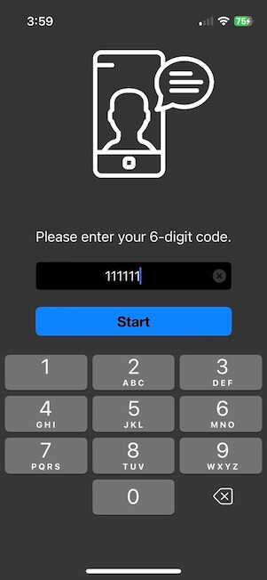
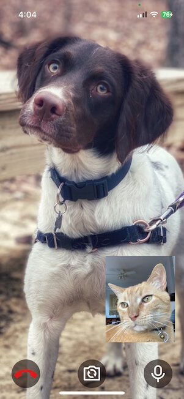

# Connect Demo

A video chat demo in Swift using Vonage's [OpenTok iOS SDK](https://tokbox.com/developer/sdks/ios/).   See sample [images](#app-images) below

## Quick Start

 1. Get values for your OpenTok **API key**, **session ID**, and **token**. See [Obtaining OpenTok Credentials](#obtaining-opentok-credentials)
    for more information.  Easiest way for a simple demo is using the [Video API Playground](#video-api-playground) 
 
 2. Open [Local.xcconfig](./ConnectDemo/Local.xcconfig) and enter your **API key**, **session ID**, and **token**
 
 3. Install [SwiftLint](https://github.com/realm/SwiftLint) `brew install swiftlint`
 
 4. Install CocoaPods as described in [CocoaPods Getting Started](https://guides.cocoapods.org/using/getting-started.html#getting-started).
 
 5. In Terminal, `cd` to your project directory and run `pod install`.
 
 6. Open your project in Xcode using the new `.xcworkspace` file in the project directory.
 
 7. Begin tokbox session with other party. Easiest way for a simple demo is using the [Video API Playground](#video-api-playground) 
 
 8. When the app start, enter any 6 digits to begin call.
 
 
 
## Obtaining OpenTok Credentials

To use the OpenTok platform you need a session ID, token, and API key. You can get these values by creating a project on your [OpenTok Account Page](https://tokbox.com/account/) and scrolling down to the Project Tools section of your Project page. For production deployment, you must generate the session ID and token values using one of the [OpenTok Server SDKs](https://tokbox.com/developer/sdks/server/).

## Video API Playground

Vonage's [Video API Playground](https://tokbox.com/developer/tools/playground/) is useful tool when working with the tokbok sdks.

## App Images

 

